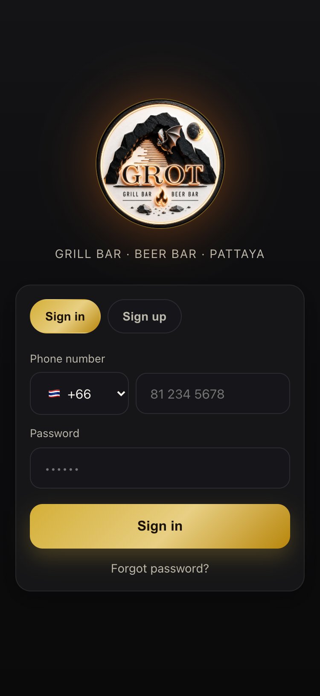
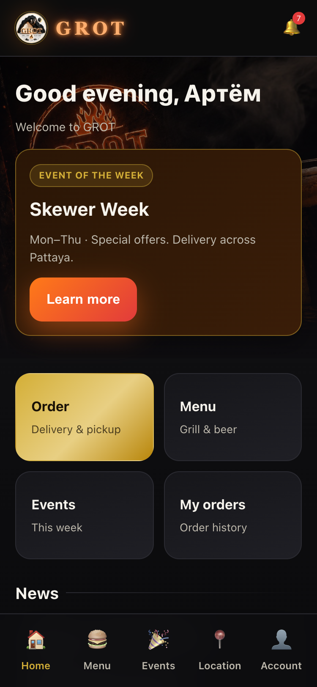
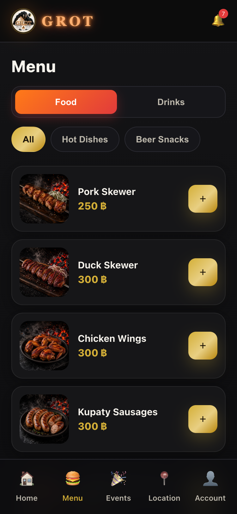
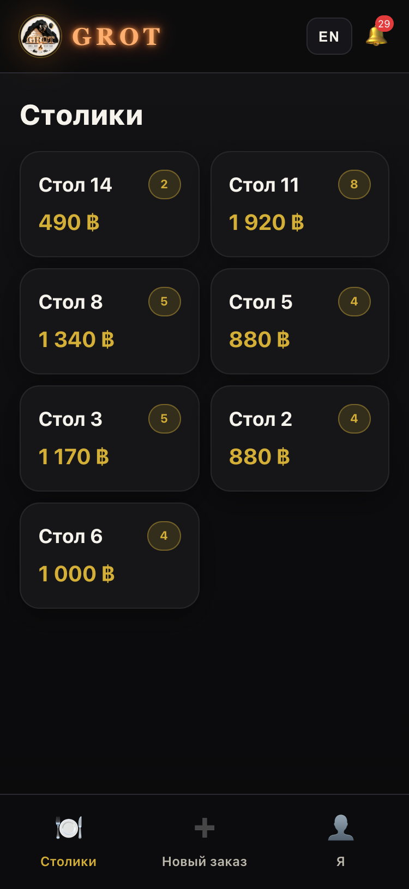
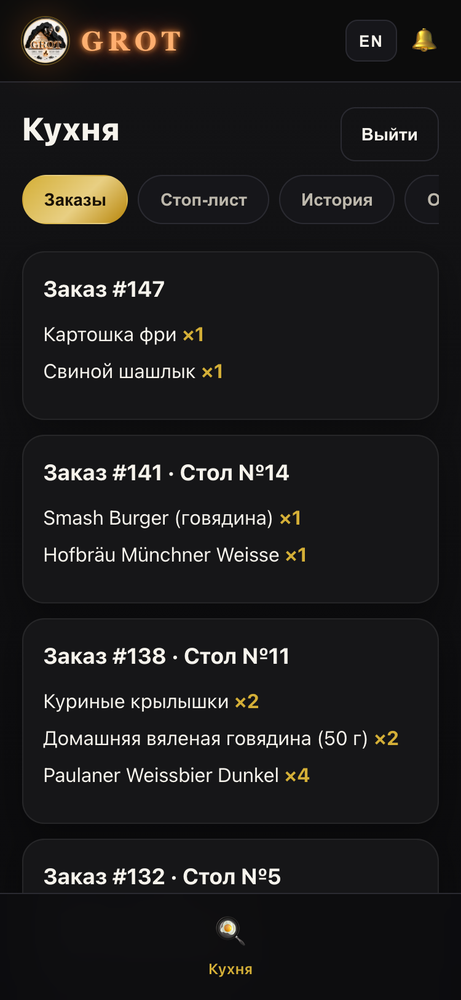
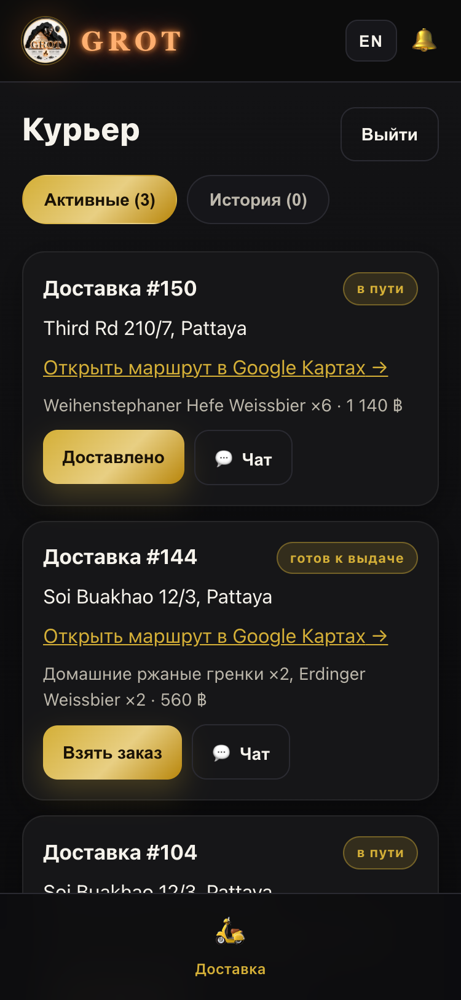
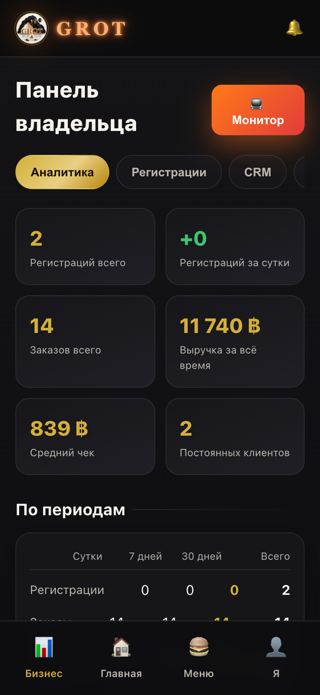

# GROT — Bar & Restaurant Operations App

A restaurant platform built for a real venue in Pattaya, Thailand: guest
ordering, table service, kitchen display, delivery dispatch, inventory, CRM and
analytics — one codebase, six roles, one API.

**~5,000 lines of application code on 5 runtime dependencies.** Authentication,
password hashing, rate limiting, persistence and the receipt printer driver are
written by hand rather than pulled in as packages.

🔗 **Live demo:** https://grot-app.onrender.com · 🇷🇺 [Русская версия](README.ru.md)

> Sign up with any phone number to explore the full guest experience. Staff and
> management panels are credential-gated — demo accounts are deliberately not
> seeded in production, for the reason described under [Security](#security).

---

## Screens

| Sign in | Guest home | Menu |
|:---:|:---:|:---:|
|  |  |  |

| Waiter · open tables | Kitchen · live tickets | Courier · dispatch | Owner · analytics |
|:---:|:---:|:---:|:---:|
|  |  |  |  |

---

## What it does

Six roles share one API, each with its own navigation and permission set.

| Role | Capabilities |
|---|---|
| **Guest** | Menu, cart, delivery or pickup, table booking, QR table check-in, order chat with the courier, events, loyalty tiers |
| **Waiter** | Open tabs by table, add items to a running order, split the bill, close with cash or card, guest call-ups |
| **Kitchen** | Live ticket queue, per-item stop-list, shift report |
| **Courier** | Assigned deliveries, route to address, chat with the guest, hand-off confirmation |
| **Admin** | Orders, reservations, menu availability, staff, push broadcasts |
| **Owner** | Revenue and average-cheque analytics, per-employee stats with CSV export, CRM, inventory, staff management |

Beyond the obvious CRUD:

- **Inventory tied to recipes.** Each dish declares its ingredients; completing
  an order writes stock off automatically and flags items below their minimum.
- **Bluetooth thermal printing.** Kitchen and receipt tickets print to an ESC/POS
  printer directly from the Android build.
- **Bilingual by design.** Guests get English — Pattaya is a tourist town —
  while staff and management get Russian. This is a product decision, not an
  oversight: translation is applied per role in `App.jsx`.
- **Installable.** PWA with a service worker, plus native iOS and Android builds
  via Capacitor from the same source.

---

## Stack

**Backend** — Node.js, Express, ES modules. `express` and `cors` are the only
runtime dependencies. 64 REST endpoints.

**Frontend** — React, Vite, React Router. No UI kit, no state library, no CSS
framework — hand-written CSS with design tokens, state through Context.

**Mobile** — Capacitor (iOS + Android), service worker, Web Push.

**Infrastructure** — Docker, Render Blueprint (`render.yaml`), persistent volume.

---

## Architecture

```
backend/
  server.js        64 REST endpoints, request validation, business rules
  db.js            in-memory domain state + development seed data
  persistence.js   JSON snapshot to disk, atomic write + rotating backups
  security.js      tokens, password hashing, rate limiting, RBAC
  integrations/    maps, web push, SMS
frontend/src/
  screens/         one file per role-facing screen
  components/      shared UI primitives
  context/         global store — auth, cart, language, toasts
  i18n.js          RU/EN dictionaries
  printer.js       ESC/POS over Bluetooth serial
```

**Storage.** State lives in memory and is snapshotted to JSON on disk, so it
survives restarts and redeploys. `persistence.js` is deliberately the only
module that knows about storage — moving to PostgreSQL means replacing that one
file, with no changes to the API layer. For a single venue this trades
scalability for zero operational overhead, which was the right call here.

**Order pricing.** The client sends only item IDs and quantities. The server
looks up its own menu, recalculates the total, and rejects unavailable dishes or
food ordered while the kitchen is closed. Client-supplied prices are never
trusted.

---

## Security

Written without auth libraries, so every decision is explicit:

- **Tokens** — HMAC-SHA256 signed, verified with `crypto.timingSafeEqual` so the
  comparison cannot leak through timing.
- **Passwords** — scrypt with a per-user random salt, compared in constant time.
- **Brute force** — sliding-window rate limit on auth endpoints, 10 requests per
  minute per IP and path.
- **Authorization** — `requireRole()` on every staff endpoint; the role comes
  from the verified token, never from the request body.
- **Mass assignment** — field whitelisting through `pick()`, with an explicit
  `__proto__` guard against prototype pollution.
- **Demo accounts** — seeded in development only. This repository is public, so
  seeding them in production would hand anyone an owner account. The first
  production owner comes from `OWNER_PHONE` / `OWNER_PASSWORD`, and the server
  warns on startup about any account still using a demo password.
- **Signing secret** — read from the environment, or generated once and stored
  with `0600` permissions on the persistent volume.

---

## Running locally

Requires Node.js 18+.

```bash
git clone https://github.com/artemfazleev1-cmd/grot-app.git
```

```bash
cd grot-app && npm run install:all
```

Backend on `:4000`:

```bash
npm run dev:backend
```

Frontend on `:5173`, proxying `/api` to the backend:

```bash
npm run dev:frontend
```

Open http://localhost:5173. Development seeds a full venue — 38 menu items, 41
ingredients, 16 tables, sample orders — and these accounts:

| Role | Phone | Password |
|---|---|---|
| Owner | `+66800000000` | `owner` |
| Admin | `+66811111111` | `admin` |
| Waiter | `+66822222222` | `waiter` |
| Kitchen | `+66833333333` | `cook` |
| Courier | `+66844444444` | `courier` |
| Guest | `+66855555555` | `client` |

---

## Deployment

`render.yaml` is a Render Blueprint — point Render at the repository and it
builds the Docker image, mounts a 1 GB volume for state, and generates the
signing secret. Set `OWNER_PHONE` and `OWNER_PASSWORD` to create the first owner
account. Web Push, SMS and Maps activate when their keys are present and degrade
quietly when they are not.

Mobile builds via Capacitor:

```bash
npm run build:app
```

---

## What I would do differently

- **TypeScript from the start.** Orders, roles and statuses are exactly the
  shapes a type system pays for. Retrofitting is on the list.
- **Tests.** There are none. The honest reason is that this shipped under
  deadline for a venue that needed it working. `security.js` and
  `persistence.js` matter most and are where I would start.
- **PostgreSQL.** The JSON snapshot is right for one venue and wrong for two.
  The abstraction is in place; the migration is not.
- **Split `server.js`.** At 861 lines it should be routers grouped by domain.
- **Optimistic UI on the waiter screen.** Every action round-trips today, which
  is noticeable on venue Wi-Fi.

---

Built by [Artem Fazleev](https://github.com/artemfazleev1-cmd).
